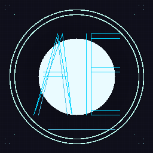

<div align="center">

  <!-- Avatar -->
  

  # 👋 CONSTANZA

  **AI Engineer · Creator of AIGENEV7 · Open Source Advocate**

  [](https://github.com/constanza8999)
  [](https://github.com/constanza8999/aigenev7.com)
  [](https://github.com/constanza8999)

  ---

  ## 🚀 About Me

  I build **AI-powered tools** that make developers' lives easier. My flagship project, **AIGENEV7**, is a local-first AI coding agent that runs entirely on your machine — no subscriptions, no cloud dependency, no censorship.

  - 🔭 **Currently building:** [AIGENEV7](https://github.com/constanza8999/aigenev7.com) — multi-model AI coding agent
  - 🌱 **Learning:** Advanced agent architectures, distributed systems
  - 💬 **Ask me about:** AI, coding agents, local LLMs, TypeScript, Bun
  - ⚡ **Mission:** AI should be accessible to everyone, not just those who can afford subscriptions

  ---

  ## 🛠️ Tech Stack

  ```
  Languages:    TypeScript, JavaScript, Python, Bash
  Runtimes:     Bun, Node.js
  Frameworks:   React, OpenTUI
  Infra:        Docker, Linux, Windows
  AI/ML:        LLM APIs, Agent Frameworks, RAG
  Tools:        Git, VS Code, 7-Zip
  ```

  ---

  ## 🌟 Featured: AIGENEV7

  > ### 🎯 Free AI Coding Agent — All Models Unlocked

  | Feature | Description |
  |---------|-------------|
  | 🤖 **10+ Providers** | DeepSeek, OpenAI, Anthropic, Google, Grok, Kimi, MiMo, MiniMax, NVIDIA, OpenRouter |
  | 💻 **100% Local** | Your code never leaves your machine |
  | 🔥 **Unlimited** | No token limits, no rate limits, no session caps |
  | 🚫 **Uncensored** | No filters, no restrictions, complete freedom |
  | 🎨 **Beautiful TUI** | Terminal UI with syntax highlighting, diffs, animations |
  | 🔑 **No Subscription** | Just bring your own API key — free forever |

  <p align="center">
    <a href="https://github.com/constanza8999/aigenev7.com">
      
    </a>
    <a href="https://github.com/constanza8999/AIGENEV7---ALL-MODELS-UNLOCKED">
      
    </a>
  </p>

  ---

  ## 📊 GitHub Stats

  <div align="center">
    
    
  </div>

  ---

  ## 📫 Connect

  -  — That's here!
  -  — [aigenev7.com](https://github.com/constanza8999/aigenev7.com)
  -  — [Download the EXE](https://github.com/constanza8999/aigenev7.com/releases/tag/v7.0.0)

  ---

  <p align="center">
    <i>"Building the future of free, accessible AI — one commit at a time."</i>
  </p>

  <p align="center">
    
  </p>

</div>
